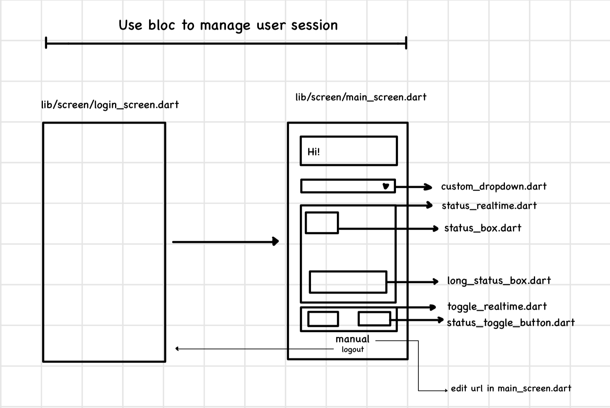

# Smart Farm Flutter App

This repository contains the source code for a Flutter-based smart farming application. This app allows users to monitor real-time sensor data, control actuators, and receive alerts for critical events.

## Project Setup

**Prerequisites:**

* Flutter SDK (installation instructions: https://flutter.dev/docs/get-started/install)
* Android Studio or VS Code (with Flutter extension)
* A Firebase project (https://firebase.google.com/)

**Steps:**
first build can takes up to 10min

1. **Clone the Repository:**
```
   git clone [https://github.com/understann/smart_farm.git](https://github.com/understann/smart_farm.git)
```

2. **Install Dependencies:**
```
cd smart-farm-app
flutter pub get

```
3. **Config firebase for each platform:**
- https://firebase.google.com/docs/android/setup
- https://firebase.google.com/docs/ios/setup

4. **run the app :**
```
flutter run
```

## App UI Structure

